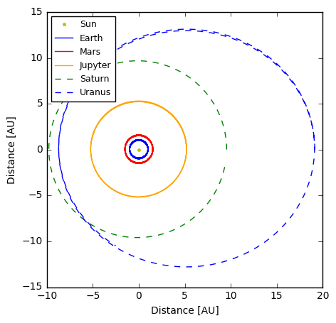

# verlet-simulation
Planetary Orbit Simulation Exercise Using the Verlet Algorithm

# Summary 
This implementation is based on [this paper](http://physics.ucsc.edu/~peter/242/leapfrog.pdf) outlining the so-called 'Leap-Frog' or Verlet Algorithm. This algorithm can be applied to various scenarios, but it is used here to simulate planetary orbits on a 2D plane. 

The idea is that, given an initial set of conditions such as the position and velocity of an object, one can predict its position and velocity for the next time step, if all forces are known. My implementation takes into account the gravitational forces of all major objects within our solar system -- the Sun and 9 (yes, including Pluto) planets.

This method differs only slightly from Euler Integration; while Euler Integration is a first-order method, Verlet is a second-order method and thus slightly more precise, making it more desirable to use for position and velocity predictions. I won't get into the math here, as it is very simply summarized in the paper linked above, but I make specific reference to the equations in the paper using equation numbers in my code.

Below is one of the plots generated by the simulation, showing the orbits of Earth, Mars, Jupyter, Saturn, and Uranus. All of the orbital parameters are fairly consistent with the true eccenstricities, and follow basic Newtonian laws such as Conservation of Angular Momentum and all three of Kepler's Laws of Planetary Motion

